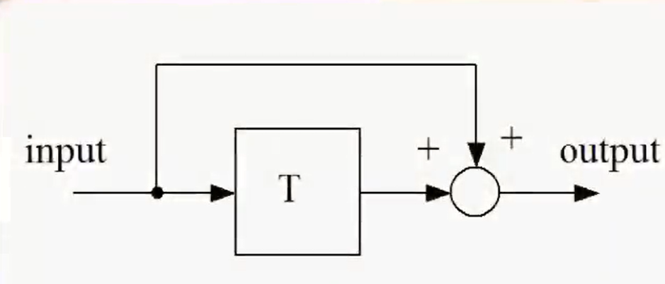
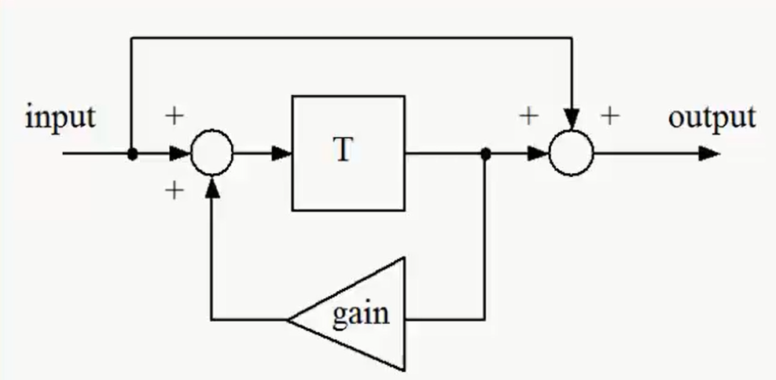
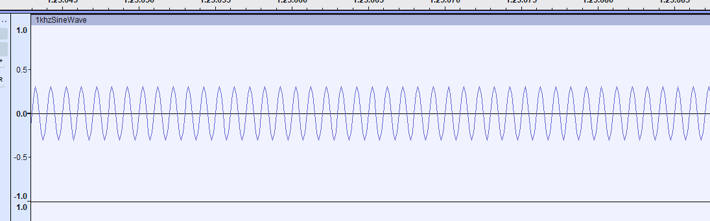
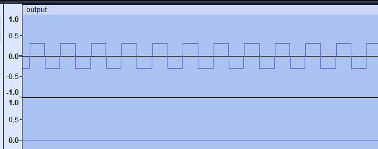
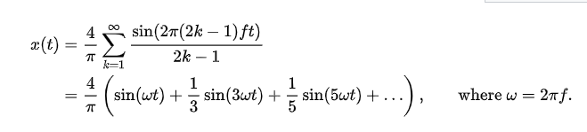
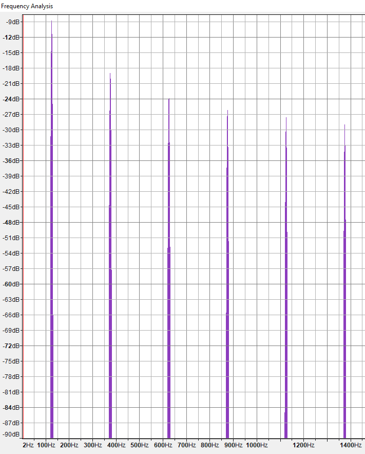

# CppDspAudio
testing dsp algorithms on audio

we are using SDL to read a .wav audio file
we store the file into a buffer, manipulate the buffer then save it or play it back.

## Delay
To add a delay we take the input buffer, delay it by a set amount of time, then add it back to the original output as shown below

*Taken from Arm DSP course*

## Echo
An echo works similar to a delay but we take feedback signal from the delayed input multiplied by a set amount of gain and add it back to the input before the delay (feedback multiplied by gain create that fading echo sound)
We apply the echo only to the left Audio channel so if you are wearing headphones you can here the original audio on the right audio channel and modified audio on the left audio channel

<video controls>
  <source src="https://github.com/HadySK/CppDspAudio/raw/refs/heads/main/docs/echoAudio.mp4" type="video/mp4">
</video>

## Generating a sine wave
To generate a sine wave, we create a look up table for the sin wave values and assign each point to a sample then save the wav file, alternatively we can just use the equation below(both option are present in the code). we have to specifiy the frequency, because we are using 8 sine wave points, we have to set the frequency to 8000 instead of 1000 to get 1Khz sine wave.
sine_table[i] = 10000sin(2*pi*i/8) << if we use 1000 instead of 10000 we get the same sine wave but smaller amplitude

## Generatine a squar wave
We adjust the sine wave code by changing the lookup table to switch between two opposite fixed values (10000,-10000) to generate a square wave of 125Hz

The ideal square wave contains only components of odd-integer harmonic frequencies (of the form 2π(2k − 1)f).
 3rd harmonic frequency = 375 Hz
 5th harmonic frequency = 625 Hz
 7th harmonic frequency = 875 Hz

Using Audacity, we can see the harmonics when we analyze the frequency of the wav file for the 125hz square wave

Run project using Visual Studio 2022

## references

audio samples taken from here https://github.com/voxserv/audio_quality_testing_samples
Square Wave analysis https://en.wikipedia.org/wiki/Square_wave_(waveform)#Fourier_analysis