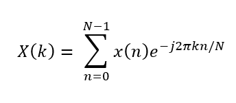
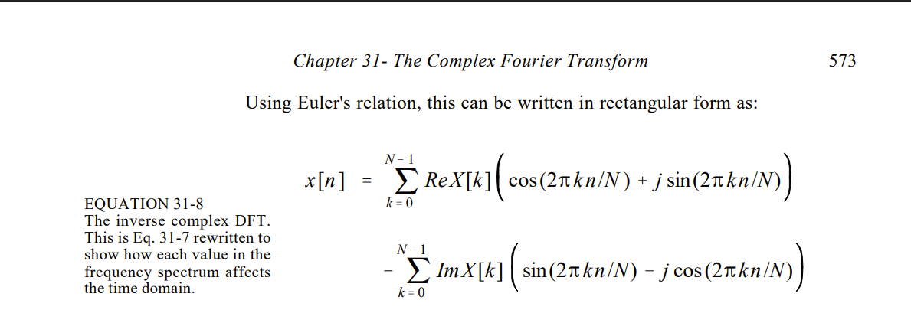
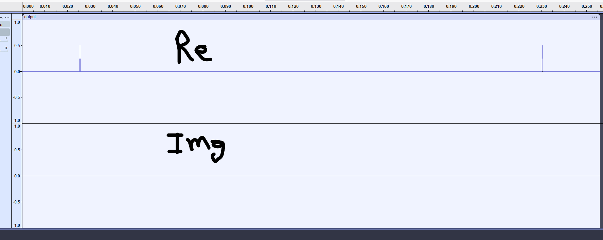
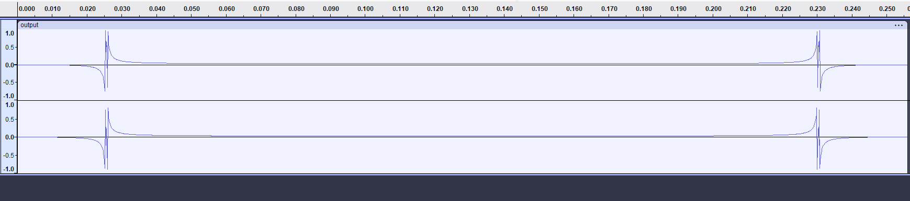
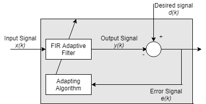
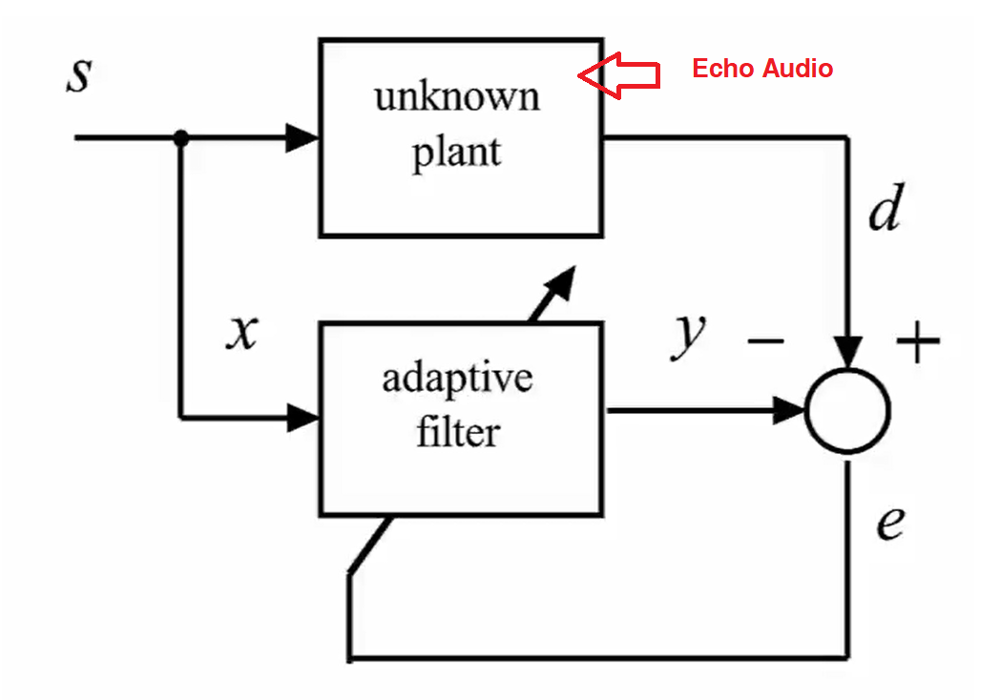
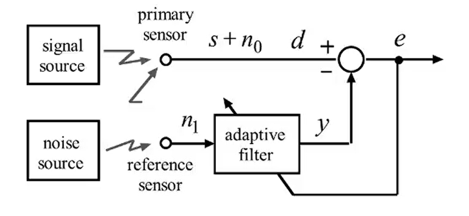

# CppDspAudio
testing dsp algorithms on audio


We are using SDL to read a .wav audio file, store it into a buffer, manipulate the buffer then save it or play it back.    
The audio file is used as an analog signal source, after running each function we can save the signal as .wav file then analyze it using audio software like Audacity to act as our oscilloscope.  
What's cool about this repo is that all you need is a c++ compiler, SDL2, and Audacity to run and analyze all the functions without the need for any extra hardware.


## Delay
To add a delay we take the input buffer, delay it by a set amount of time, then add it back to the original output as shown below

*Taken from Arm DSP course*

## Echo
An echo works similar to a delay but we take feedback signal from the delayed input multiplied by a set amount of gain and add it back to the input before the delay (feedback multiplied by gain create that fading echo sound)
We apply echo only on the left Audio channel so if you are wearing headphones you can here the original audio on the right audio channel and modified audio on the left audio channel. Results in audioExamples folder, Ex1.


https://github.com/user-attachments/assets/4fffd921-b9a2-47a6-a436-ec02117e1b39  

[Audio Backup link](https://github.com/HadySK/CppDspAudio/raw/refs/heads/main/docs/echoAudio_.wav)

## Generating a sine wave
To generate a sine wave, we create a look up table for the sin wave values and assign each point to a sample then save the wav file, alternatively we can just use the equation below(both option are present in the code). we have to specifiy the frequency, because we are using 8 sine wave points, we have to set the frequency to 8000 instead of 1000 to get 1Khz sine wave.
sine_table[i] = 10000sin(2*pi*i/8) << if we use 1000 instead of 10000 we get the same sine wave but smaller amplitude


## Generating a square wave
We adjust the sine wave code by changing the lookup table to switch between two opposite fixed values (10000,-10000) to generate a square wave of 125Hz


  


The ideal square wave contains only components of odd-integer harmonic frequencies (of the form 2π(2k − 1)f).
 3rd harmonic frequency = 375 Hz
 5th harmonic frequency = 625 Hz
 7th harmonic frequency = 875 Hz

Using Audacity, we can see the harmonics when we analyze the frequency of the wav file for the 125hz square wave


## Finite Impulse Response (FIR) Filter (Moving Average Filter)
We will use a moving average filter as an example of an FIR filter.
Moving average filter is a low pass so in theory if we take our echo audio file and applying a movingaverage filter we should see some of the higher frequencies cut off.
Lets take a look at our echo audio file frequencies


*We have frequencies up to 21kHz*

now lets look at the same file frequencies after applying the moving average filter

*Frequencies after 15kHz are cut off*

Only frequencies below 15kHz make it through and the rest are cut off

We can use the moving average filter for noise cancelling by removing specific frequencies out of an audio signal, see AudioExamples ex2.


## Infinite Impulse Response (IIR) Filter (2nd Order Elliptic Filter)
We will use Matlab filter design tool to generate the coefficients for a fourth order elliptical low pass IIR filter with a cutoff frequency of 8000Hz, 1dB ripple in the pass band and 50dB of stop band attenuation.


We will use the same mono audio file,below is the frequency analysis after applying the elliptic IIR filter

*Frequencies after 15kHz are cut off*

## Discrete Fourier Transform (DFT)
Discrete fourier transform converts a signal from time domain to frequency domain.


we divide the equation into Real(cosine) and imaginary (sine) parts


our DFT function creates an 800hz sinusoidal wave then it goes through DFT where the real part will be assigned to left audio channel and imaginary part assigned to right audio channel. 



Looking at the generated wave, the imaginary part magnitude is zero and the real part all values are zero except for two values. these are the representation of the 8khz input signal in
frequency domain.
The first spike is a representation of the positive 800hz input signal, the second spike
Based on Euler's formula, a real valued sinusoidal signal may be represented by a pair of complex exponentials in the frequency domain corresponding to two contra-rotating phasors. the second spike is the representation of a signal at negative 800hz. In the frequency the value takes both positive and negative frequencies

cool animation of the two phasors can be found in here 👉 [Rotating Phasors](https://dspfirst.gatech.edu/chapters/03spect/demos/phasors/graphics/phasorsn.mp4)

if we increase the number of samples to 4096. we get spectral leakage and see the following spikes on both real and imaginary parts


this happens because our 800hz is not integer multiple of the sample frequency divied by N. and there is no single value of k that correspond exactly to that frequency.
we can work around that and set our test frequency to a float that matches exactly (800.78125f)

## Fast Fourier Transform (FFT)
One way to make DFT faster is to precalculate and store the twiddle factors, then it will be used a lookup table of twiddle  factors

```cpp
Execution time DFT : 1861 ms
Execution time DFT with precalculated twiddle : 129 ms
```
We can that with the precalculated twiddle factors, the DFT function is about 14 times faster than regular DFT function.

For FFT we will use Radix-2 Algorithm,
Radix-2 algorithm is one of the Fast Fourier transform (FFT) algorithms. It computes separately the DFTs of the even-indexed inputs (x<sub>0</sub>, x<sub>2</sub>,..., x<sub>N-2</sub>) and of the odd-indexed inputs (x<sub>1</sub>, x<sub>3</sub>,..., x<sub>N-1</sub>, and then combines those two results to produce the DFT of the whole sequence. This idea can then be performed recursively to reduce the overall runtime from O(N<sup>2</sup>) to O(N logN).
Radix-2 algorithm requires that N(sample points) is a power of two.

```cpp
Execution time DFT : 1861 ms
Execution time DFT with precalculated twiddle : 129 ms
Execution time Radix-2 FFT : 813 us
```
Radix-2 FFT  is 155 times faster than DFT with precalculated twiddle factor, and about 2000 times faster than regular DFT !

Note that DFT_FFT function produces the same result with generated sin wave, but when using an audio file the result varies compared to DFT and DFT_Twiddle functions, I need to double check that fun to make sure all the calculations are correct.

## Adaptive filter Least Mean-Squares (LMS) algorithm
Adaptive filters works in a similar way to NN optimization problems. 
We have i/p signal x and o/p signal y, and desired value d. 
Our error function e = d - y where y is x * w where w is our adaptive filter coefficient, then we just try to minimize the error by finding the right weights using something like steepest-descent 



In the function adaptiveFilterEcho, we test another functionality of adaptive filter which is the ability to identify an unkown system, we basically give the i/p signal going into both the adaptive filter and the unkown system, then we calculate the error and update the weight until the adaptive filter behaves similar to the unkown system


In order to test this, our i/p signal will be regular voice recording, and the desired signal will be the same voice recording but with added echo using audioEcho function. the end the result after the adaptive filter learning the system, is that this filter should be able to add echo to any audio signal. Results in audioExamples folder, Ex2.

quick note: as we increase the number of weights the adaptive filter behaves closer to the original system at the expense of longer computation time.

Another use case of adaptive filter is noise cancelling (function adaptiveFilterNC), our desired signal will be our audio source + noise , and the input to the adaptive filter will be the noise reference.
The adaptive filter acts on noise reference (n1) to produce a close replica of noise in the signal source(n0), which is then subtracted from the primary sensor signal (s+n0) with the objective of making (s+n0)-y a best fit to s.
If adaptation successful then Y should equal n0 , and e = s+n0 – n0 = s , our output will be e which is the audio source without noise. Results in audioExamples folder, Ex3.



## Build & Run


Project uses C++14 & SDL2
The project in the repo is made using Visual Studio 2022.

## Notes
* This repo is for learning about and testing DSP algorithms, so you will find a lot of print lines, global variables, duplicates of functions and things like that throughout the code that were added for debugging purposes. I'll be cleaning up the code from time to time.
* The audio files in AudioExamples folder have trimmed to keep the file size small, You can find full Audio samples in [1], [6] has samples of speech with noise added for testing NC algorithms.
* The code is written in C++ but it should be easy to port it to C incase you need to run this code on embedded HW. Just need to remove the ocassional vector and Std Function and you should be good to go.


## References

[1] audio samples taken from here https://github.com/voxserv/audio_quality_testing_samples
[2] Square Wave analysis https://en.wikipedia.org/wiki/Square_wave_(waveform)#Fourier_analysis
[3] DFT https://www.analog.com/media/en/technical-documentation/dsp-book/dsp_book_Ch31.pdf
[4] Rotating Phasors https://dspfirst.gatech.edu/chapters/03spect/demos/phasors/index.html
[5] FFT https://www.phys.uconn.edu/~rozman/Courses/m3511_19s/downloads/radix2fft.pdf
[6] https://github.com/arm-university/Digital-Signal-Processing-Education-Kit
