# CppDspAudio
testing dsp algorithms on audio

We are using SDL to read a .wav audio file, store it into a buffer, manipulate the buffer then save it or play it back.

## Delay
To add a delay we take the input buffer, delay it by a set amount of time, then add it back to the original output as shown below
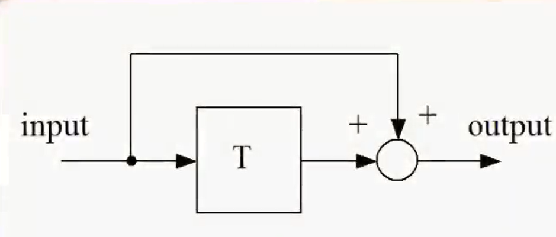
*Taken from Arm DSP course*

## Echo
An echo works similar to a delay but we take feedback signal from the delayed input multiplied by a set amount of gain and add it back to the input before the delay (feedback multiplied by gain create that fading echo sound)
We apply the echo only to the left Audio channel so if you are wearing headphones you can here the original audio on the right audio channel and modified audio on the left audio channel
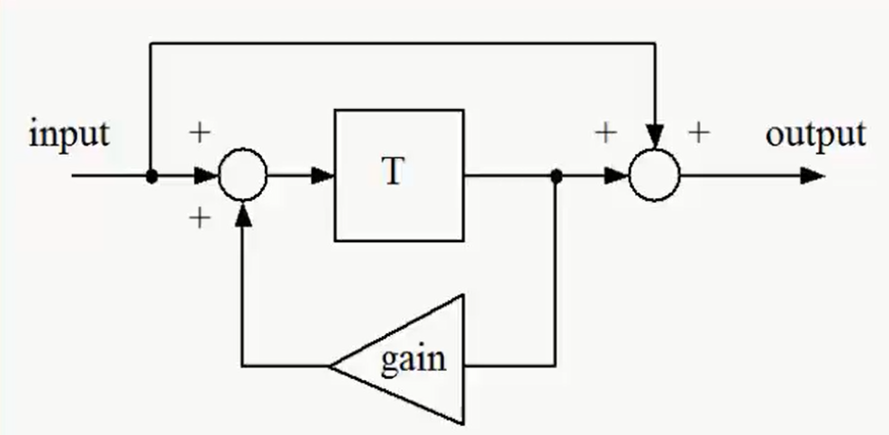

https://github.com/user-attachments/assets/4fffd921-b9a2-47a6-a436-ec02117e1b39  

[Audio on Mobile](https://github.com/HadySK/CppDspAudio/raw/refs/heads/main/docs/echoAudio_.wav)

## Generating a sine wave
To generate a sine wave, we create a look up table for the sin wave values and assign each point to a sample then save the wav file, alternatively we can just use the equation below(both option are present in the code). we have to specifiy the frequency, because we are using 8 sine wave points, we have to set the frequency to 8000 instead of 1000 to get 1Khz sine wave.
sine_table[i] = 10000sin(2*pi*i/8) << if we use 1000 instead of 10000 we get the same sine wave but smaller amplitude
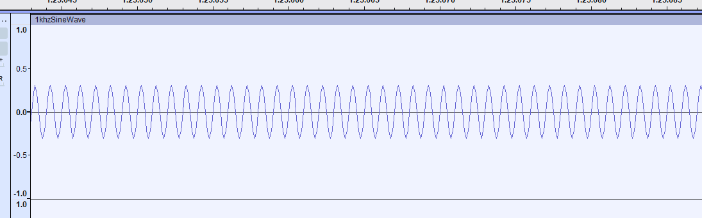

## Generating a square wave
We adjust the sine wave code by changing the lookup table to switch between two opposite fixed values (10000,-10000) to generate a square wave of 125Hz

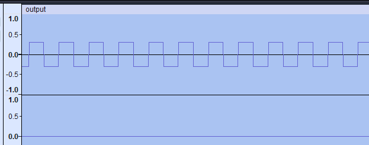

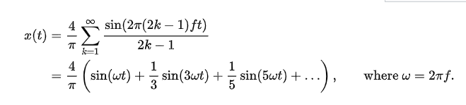  

The ideal square wave contains only components of odd-integer harmonic frequencies (of the form 2π(2k − 1)f).
 3rd harmonic frequency = 375 Hz
 5th harmonic frequency = 625 Hz
 7th harmonic frequency = 875 Hz

Using Audacity, we can see the harmonics when we analyze the frequency of the wav file for the 125hz square wave
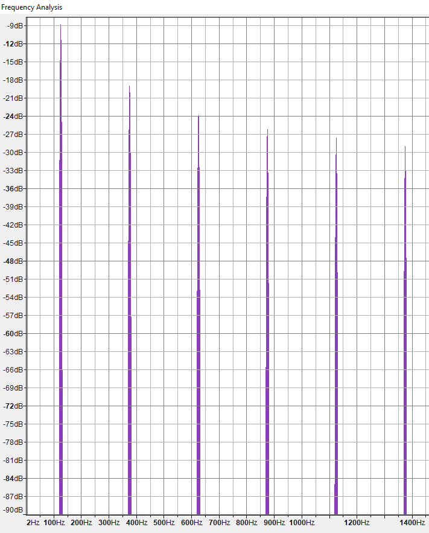

## Finite Impulse Response (FIR) Filter (Moving Average Filter)
We will use a moving average filter as an example of an FIR filter.
Moving average filter is a low pass so in theory if we take our echo audio file and applying a movingaverage filter we should see some of the higher frequencies cut off.
Lets take a look at our echo audio file frequencies

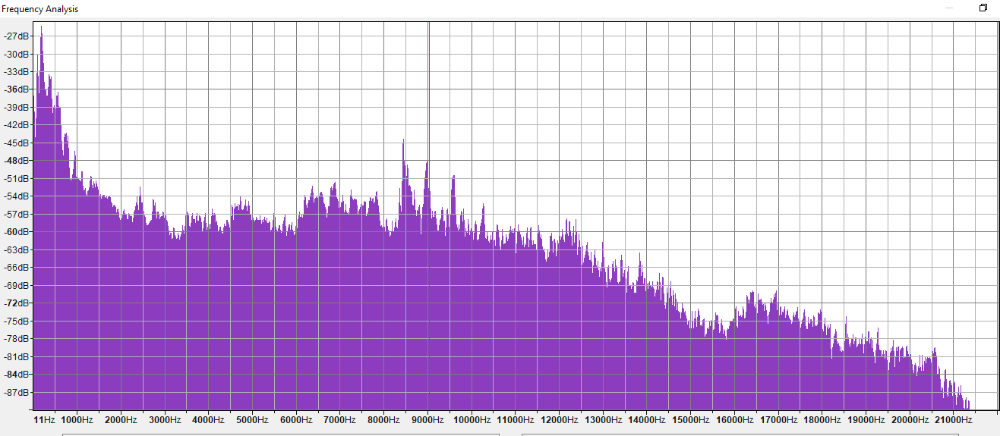
*We have frequencies up to 21kHz*

now lets look at the same file frequencies after applying the moving average filter
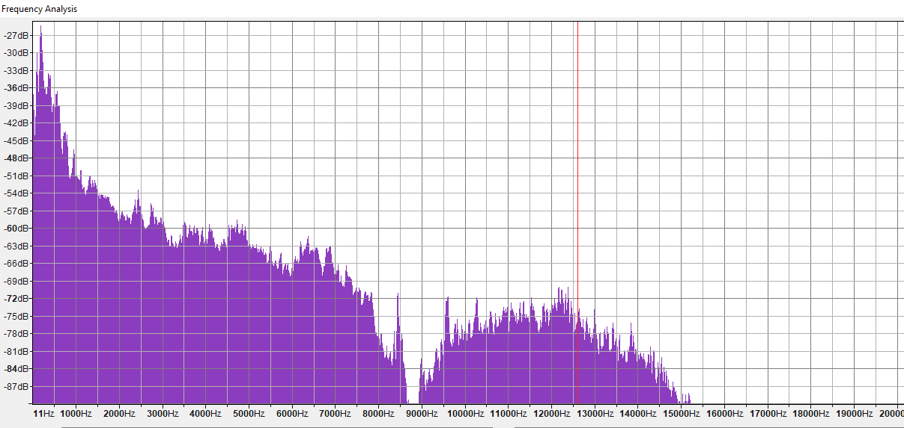
*Frequencies after 15kHz are cut off*

Only frequencies below 15kHz make it through and the rest are cut off

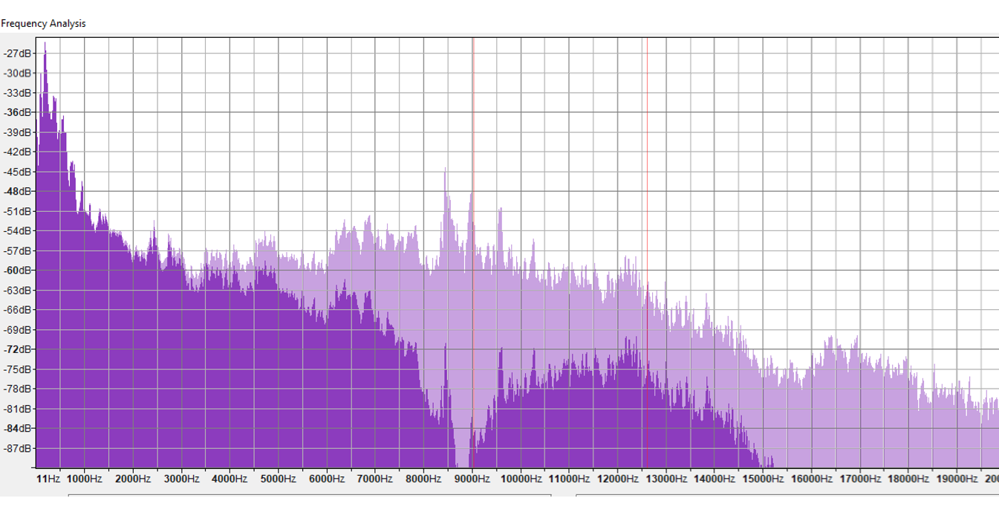
## Infinite Impulse Response (IIR) Filter (2nd Order Elliptic Filter)
We will use Matlab filter design tool to generate the coefficients for a fourth order elliptical low pass IIR filter with a cutoff frequency of 8000Hz, 1dB ripple in the pass band and 50dB of stop band attenuation.

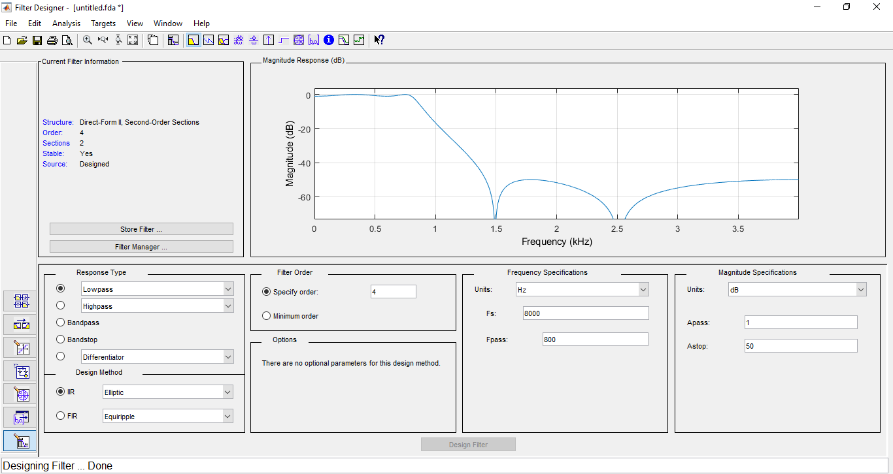

We will use the same mono audio file,below is the frequency analysis after applying the elliptic IIR filter
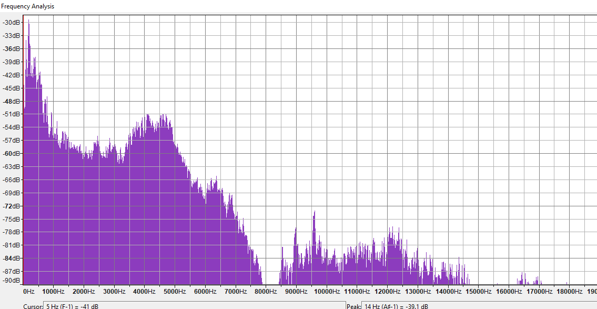
*Frequencies after 15kHz are cut off*
Run project using Visual Studio 2022

## references

* audio samples taken from here https://github.com/voxserv/audio_quality_testing_samples
* Square Wave analysis https://en.wikipedia.org/wiki/Square_wave_(waveform)#Fourier_analysis
